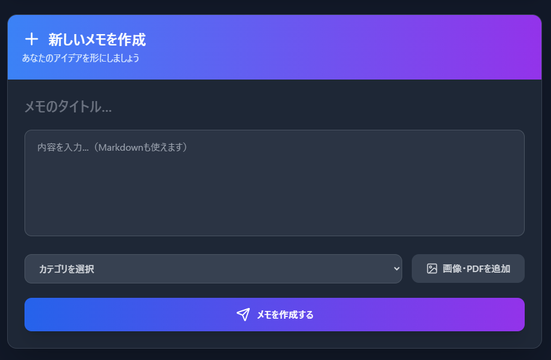
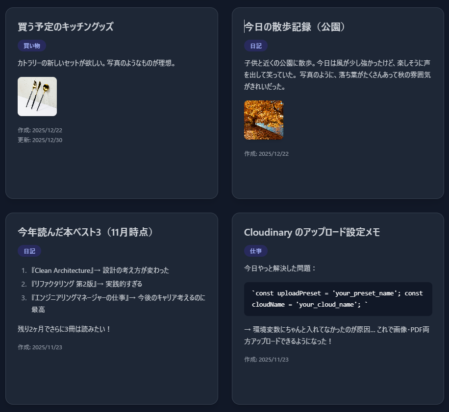

# 📒 Memo App – メモ管理アプリ

## 🔗 デプロイURL
https://mern-memo-app-client-v2.onrender.com
※スマートフォン・PC両方に対応

## 🔑 テストログイン情報
Email: t.nakanishi.dev@gmail.com 
Password: t.nakanishi.dev

## 📸 スクリーンショット

## 📝 アプリ概要
ユーザーがメモを作成・編集・分類・管理できるメモ管理ツールです。
カテゴリ分け・検索・画像添付に対応し、シンプルさと整理しやすい UI を重視しています。

## 🔧 使用技術
- フロントエンド: React, Tailwind CSS, Fetch API, React Router  
- バックエンド: Node.js, Express  
- データベース: MongoDB (Mongoose)  
- ホスティング: Render  
- その他: Firebase（画像アップロード機能）
- 認証: JWT（Cookie-based Authentication）

## ✨ 主な機能
- 📄 メモ作成・編集・削除：タイトル・本文・画像を含むメモ管理  
- 🔍 検索機能：タイトルでリアルタイム検索  
- 🏷 カテゴリ機能：カテゴリで分類・絞り込み  
- 🖼 画像アップロード：Firebaseで添付可能  
- 📱 レスポンシブ対応：モバイル・PC両方に対応

## 💡 工夫した点・学び
- 状態管理：Reactフック（useState, useEffect）で効率的管理  
- データ設計：カテゴリ・画像に対応したスキーマ設計  
- エラー対応：非同期処理やバリデーションを意識  
- UI/UX：UI/UX を意識し、余白・視認性・モバイル最適化に配慮  

## 👤 作者情報
- 名前：T.Nakanishi  
- GitHub: [https://github.com/t-nakanishi-dev](https://github.com/t-nakanishi-dev)

