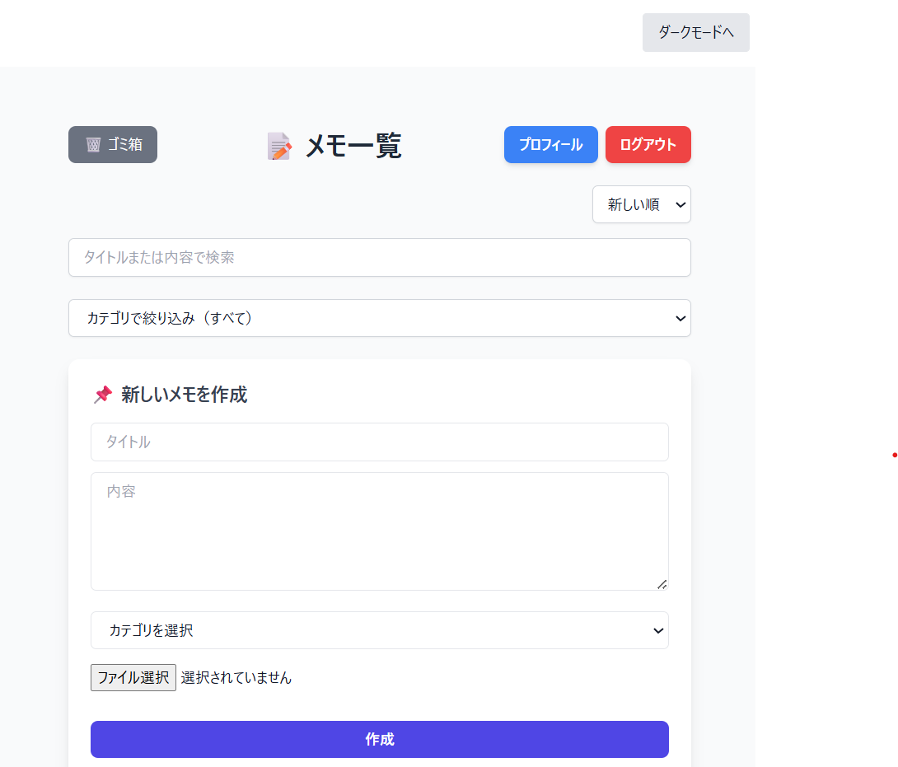
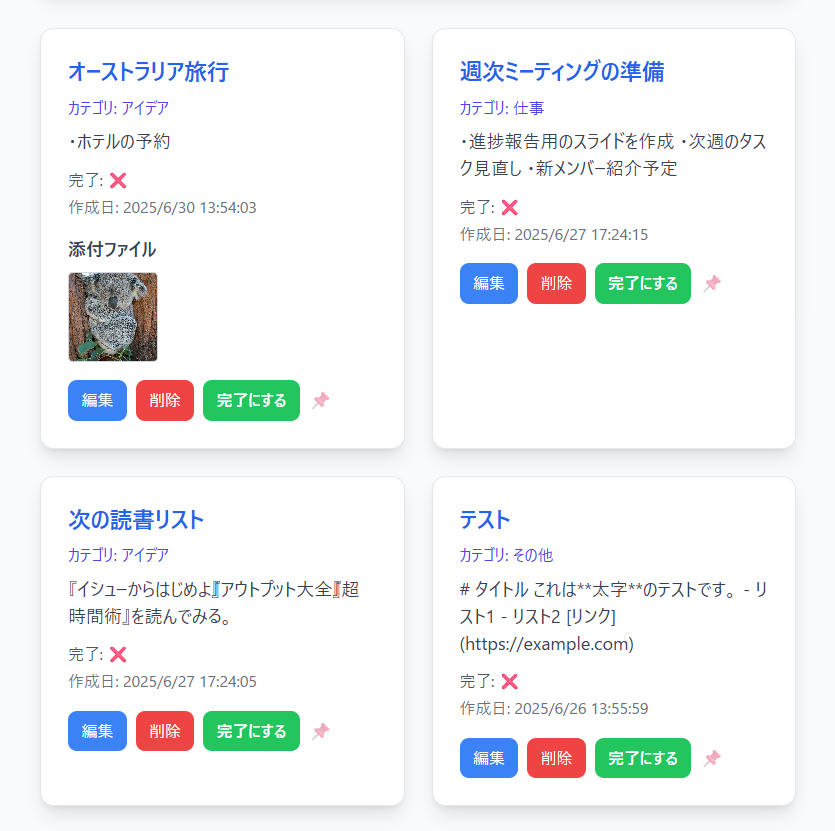

📒 Memo App – シンプルなメモ管理アプリ
🔗 デプロイURL

https://memo-app.onrender.com

※スマートフォン・PC両方に対応

🔑 テストログイン情報

Email: test@gmail.com

Password: test

📸 スクリーンショット

**PC画面**

📝 アプリ概要

ユーザーが自分のメモを作成・編集・分類・管理できるシンプルなメモ管理ツールです。

カテゴリ分け・検索・アーカイブ機能で整理性を重視

直感的で使いやすいUI設計

🔧 使用技術

フロントエンド: React, Tailwind CSS, Axios, React Router

バックエンド: Node.js, Express

データベース: MongoDB (Mongoose)

ホスティング: Render, GitHub Pages

その他: Firebase（画像アップロード機能）

✨ 主な機能

📄 メモ作成・編集・削除：タイトル・本文・画像を含むメモ管理

🔍 検索機能：タイトルでリアルタイム検索

🏷 カテゴリ機能：カテゴリで分類・絞り込み

🗂 アーカイブ / ゴミ箱：不要メモを非表示・復元

🖼 画像アップロード：Firebaseで添付可能

📱 レスポンシブ対応：モバイル・PC両方に対応

💡 工夫した点・学び

状態管理：Reactフック（useState, useEffect）で効率的管理

データ設計：カテゴリ・アーカイブ・画像に対応したスキーマ設計

エラー対応：非同期処理やバリデーションを意識

UI/UX：モバイル対応、余白・フォントサイズ調整で視認性向上

英語コメント：コード全体にコメント追加で可読性アップ

🚀 今後追加予定

📅 カレンダー表示：日付ベースでメモ管理

⏰ リマインダー機能：指定日時に通知

🌐 多言語対応：日本語／英語切替

👤 作者情報

名前：PiyoCode324

GitHub：https://github.com/PiyoCode324

📦 セットアップ方法（任意）
# クローン
git clone https://github.com/PiyoCode324/memo-app.git

# サーバー側
cd server
npm install
npm run dev

# クライアント側
cd client
npm install
npm start

📝 ライセンス

MIT
